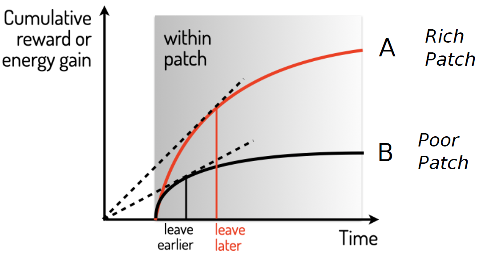
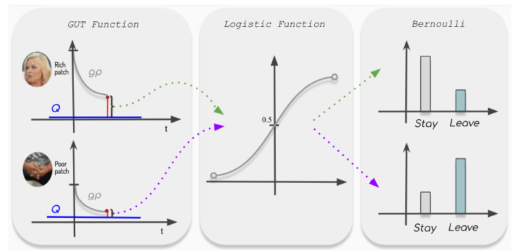
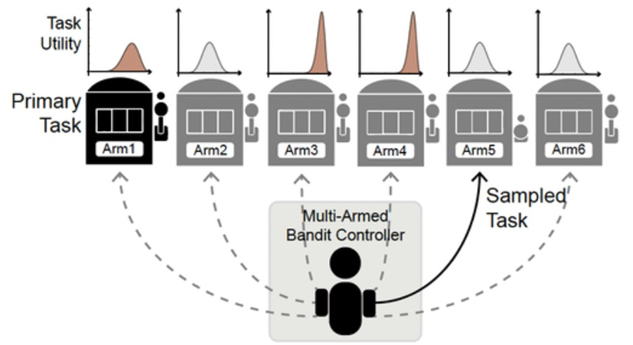
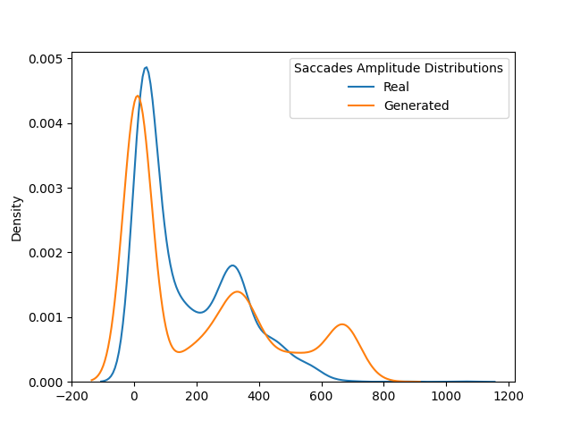
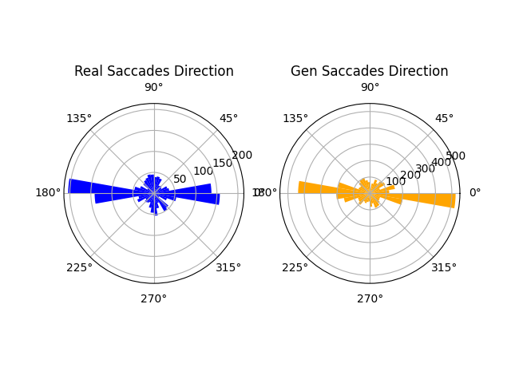
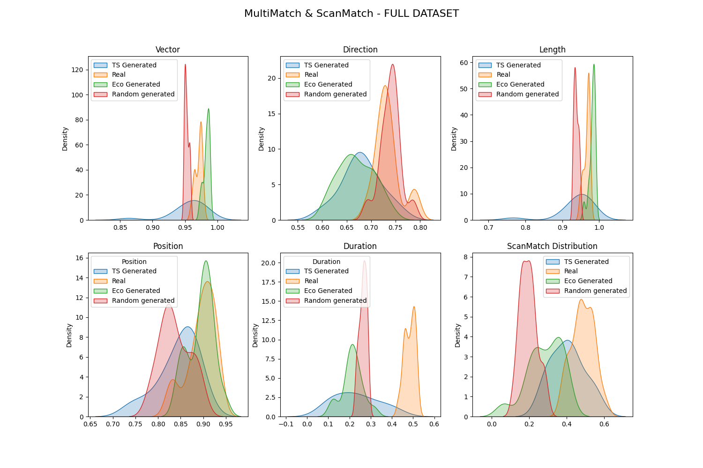

# AUDIO VISUAL ATTENTION MODELING VIA REINFORCEMENT LEARNING


[](https://github.com/DanieleBocchino/master-thesis)
[](https://github.com/DanieleBocchino/master-thesis)
[](https://github.com/DanieleBocchino/master-thesis)
[](https://github.com/DanieleBocchino/master-thesis)
[](https://github.com/DanieleBocchino/master-thesis)


## Overview

This repository contains the implementation of a predictive model that integrates audio-visual sources using reinforcement learning to explore the intricacies of foraging behavior. Inspired by the natural foraging strategies of animals, this project employs a Contextual Multi-Armed Bandit (MAB) framework with Thompson Sampling to study decision-making processes in environments characterized by resource patchiness.


### Objective
The primary goal is to provide comprehensive insights into the decision-making strategies involved when a forager decides to leave a patch, taking into consideration the expected rate of rewards. By introducing a novel concept represented as \(g(u, t)\), the model calculates the average reward expected within a specific timeframe, offering a stochastic perspective on energy intake rates which captures the probabilistic nature of foraging.

## Background

The core concept of this research is based on the foraging behavior observed in animals, focusing on how they decide to leave a patch of resources based on the expected rate of rewards. This involves a stochastic representation of the unbroken energy intake rate, encapsulating the probabilistic essence of foraging behavior.

The decision-making function at the heart of this research is modeled after the strategies animals use in the wild to determine when to leave a resource patch. This function, grounded in the principles of reinforcement learning and Bayesian decision theory, is designed to calculate and predict the optimal moment for a forager to depart from a patch, aiming to maximize overall energy intake over time.


### Understanding the Decision Function

The decision function is built on a foundation of calculating the expected reward rate, denoted as \(g(u, t)\), where \(u\) represents the forager's state, encompassing its knowledge and current situation, and \(t\) is the time. This function considers the patch's remaining resources, the forager's current energy state, and the time required to move to and exploit new patches.




#### Stochastic Representation of Energy Intake

The model employs a stochastic approach to represent the rate of energy intake, acknowledging the inherent unpredictability in the environment. This stochasticity is modeled through a probability distribution that describes the potential outcomes of staying within a patch versus leaving it for another. The decision to stay or leave is made by comparing the expected reward rate (\(g(u, t)\)) to a predefined quality threshold (\(Q\)), which is influenced by various factors including environmental richness, distance to the next patch, and potential risks like predation.




#### Bayesian Updating

A key aspect of the decision function is its use of Bayesian updating to refine the estimates of a patch's reward rate over time. As a forager consumes resources within a patch, it gathers information that updates its understanding of the patch's value. This information is used to adjust the expected reward rate (\(g(u, t)\)), making the model more accurate and tailored to the specific conditions of each patch.

#### Thompson Sampling within Contextual Multi-Armed Bandit Framework

To operationalize these concepts, the research integrates Thompson Sampling, a Bayesian approach to balancing exploration and exploitation, within a Contextual Multi-Armed Bandit (MAB) framework. Each patch is considered an 'arm' of the bandit, with its own associated reward rate. Thompson Sampling is used to decide which patch (or arm) to 'pull' based on the current understanding of each patch's reward distribution. This method allows for dynamic adjustment based on observed outcomes, optimizing the foraging strategy in a manner that closely mimics natural foraging behavior.




#### Maximizing Cumulative Rewards

The ultimate goal of the decision function is to maximize the cumulative rewards over time, taking into account both the immediate rewards and the potential future gains from exploring new patches. This involves a delicate balance between exploiting a known resource-rich patch and exploring unknown patches that might offer greater rewards.


### Implications

This decision-making function provides a nuanced and dynamic tool for understanding foraging behavior, both in animals and as a model for other types of decision-making processes. By capturing the complexity of real-world decision-making scenarios and the uncertainty inherent in natural environments, this research offers insights into optimal foraging strategies that can extend beyond the biological domain, informing algorithms in robotics, resource allocation, and even economic decision-making.


## Features

- **Bayesian Foraging Technique**: Implements a Bayesian approach to foraging, considering the forager's experiential state to optimize the decision-making process.
- **Dynamic Patch Handling**: Capable of adjusting foraging strategies in response to changes in patch availability, showcasing adaptability to dynamic environments.
- **Exponential Distribution for Search Efficiency**: Models the time a forager takes to locate an item using an exponential distribution, reflecting the natural variability in search efficiency.
- **Contextual MAB with Thompson Sampling**: Integrates Thompson Sampling within a Contextual Multi-Armed Bandit framework, balancing the exploration of unknown options and the exploitation of known resources.

## Dataset

The model was trained and tested on a dataset comprising 78 videos depicting diverse foraging scenarios in patchy environments. Training was conducted with 10 observers, and the model's predictions were validated against the behaviors of 29 test observers.

# Results Overview

This section delves into the outcomes of applying advanced methodologies, including Bayesian optimization for model tuning and the use of MultiMatch and ScanMatch analyses, to refine and evaluate the model on audio-visual attention modeling through reinforcement learning. These strategies have played a pivotal role in enhancing the model's accuracy and efficiency, mirroring the natural foraging behavior observed in animals.

## Bayesian Optimization for Enhanced Model Accuracy

To optimize the model's hyperparameters, Bayesian optimization was employed. This technique utilizes a probabilistic model to forecast performance across different hyperparameter values, aiming to improve upon the best results found so far. Such optimization is crucial for fine-tuning the decision function, which determines the optimal time for a forager to leave a resource patch, based on expected rewards. This process ensures that the model's predictions are as close to real-life animal foraging behaviors as possible.

## Evaluating Model Performance with MultiMatch and ScanMatch

### Quantitative Analysis via MultiMatch

MultiMatch analysis served to quantitatively evaluate the model by comparing human eye movement behaviors with those predicted by the model. This approach examines spatial and temporal eye movement aspects, such as fixation points, saccade paths, and fixation durations, providing a detailed comparison and validation of the model's ability to replicate human attention and decision-making during foraging.

### Qualitative Insights from ScanMatch

ScanMatch analysis offered a qualitative perspective by contrasting sequences of eye movements to discern visual exploration strategies. This method is instrumental in uncovering the cognitive strategies behind foraging decisions, revealing how individuals allocate their attention across different patches and respond to environmental stimuli.

## Key Findings from the Analyses

### Alignment with Human Behavior

- **Quantitative Validation**: The MultiMatch analysis confirmed a significant correlation between the model's predictions and actual human behavior, indicating the model's effectiveness in capturing the complexity of visual attention and decision-making strategies.
  
- **Qualitative Strategies**: Through ScanMatch analysis, the model demonstrated its capability to identify qualitative exploration strategies similar to those employed by humans, suggesting an accurate prediction of attentional focus and strategic decision-making in foraging scenarios.

### Focusing on Cumulative Rewards

An analysis of cumulative rewards highlighted a bias towards "speakers" in the videos, who generated more rewards than "non-speakers", due to the model's ability to prioritize elements with higher informational content. Despite "non-speakers" having lower average rewards, their greater abundance in the dataset led to higher cumulative rewards, illustrating the model's adaptability in optimizing reward distribution based on the context.

### Saccade Behavior Insights

- **Duration Distribution**: The model's predictions closely matched human observers' duration distributions, showcasing its ability to approximate attention patterns over time.
  
- **Saccade Patterns**: Examination of saccade amplitudes and directions revealed the model's proficiency in mimicking human saccade behaviors, further validated by kernel probability density estimations and directional analyses.




## Conclusive Insights and Future Directions

The comprehensive assessment underscores the model's potential in applications necessitating dynamic attention modeling, confirming its effectiveness in emulating foraging behavior. These results not only affirm the model's current capabilities but also lay the groundwork for future improvements, especially in enhancing its adaptability to diverse behavioral patterns.



## How to Use
1. **Setup Environment**: Instructions on setting up the required environment, including dependencies and libraries.
2. **Training the Model**: Guidelines for training the model with your dataset, including parameters to adjust for different scenarios.
3. **Evaluation**: Steps to evaluate the model's performance on test data.

### Requirements

```
pip install -r requirements.txt
```

### Executing the demo

To simulate from the model:

1. Do speaker identification and build face maps:
```
#sh build_face_maps.sh path/to/video vidName path/to/output
sh build_face_maps.sh data/videos/012.mp4 012 speaker_detect/output/
```
2. Run the train simulation
```
python3 train_simulation.py
```
3. Run the test simulation
```
python3 test_simulation.py
```
4. Analyze the results
```
python3 mm_stats.py
```

## Contributors
This project is the result of a master's thesis by [Daniele Bocchino](https://danielebocchino.github.io/), under the guidance of [Giuseppe Boccignone](https://www.unimi.it/en/ugov/person/giuseppe-boccignone) & [Alessandro D'Amelio](https://www.unimi.it/en/ugov/person/alessandro-damelio) at [PHuSe Lab](https://phuselab.di.unimi.it).


### Autor
- ***Daniele Bocchino*** 
### Teacher & Supervisor
- ***Giuseppe Boccignone¹*** 
- ***Alessandro D'Amelio¹*** 

¹ [PHuSe Lab](https://phuselab.di.unimi.it) - Dipartimento di Informatica, Università degli Studi di Milano  


### Credits

- Data: FindWhoToLookAt --->[Repo](https://github.com/yufanLiu/find), [Paper](https://ieeexplore.ieee.org/document/8360155)

- Speaker Detection Pipeline: SyncNet ---> [Repo](https://github.com/joonson/syncnet_python), [Paper](https://www.robots.ox.ac.uk/~vgg/publications/2016/Chung16a/chung16a.pdf)

- Space-time Visual Saliency Detection: [Code](https://users.soe.ucsc.edu/~milanfar/research/rokaf/.html/SaliencyDetection.html#Matlab), [Paper](http://jov.arvojournals.org/article.aspx?articleid=2122209)

- **Paper** D'Amelio, A., & Boccignone, G. (2021). [Gazing at social interactions between foraging and decision theory](https://www.frontiersin.org/articles/10.3389/fnbot.2021.639999/full?&utm_source=Email_to_authors_&utm_medium=Email&utm_content=T1_11.5e1_author&utm_campaign=Email_publication&field=&journalName=Frontiers_in_Neurorobotics&id=639999). Frontiers in Neurorobotics, 15, 31.

